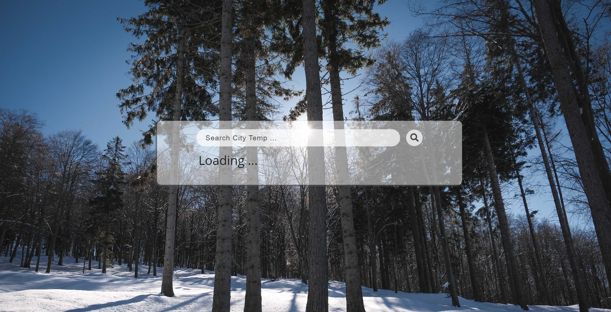
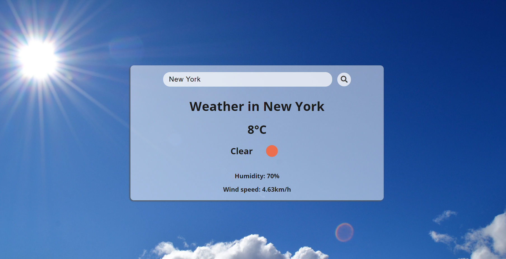

# Weather Application

This is a simple weather application that allows users to check the weather conditions of different cities.

## Features

- Users can input the name of a city and retrieve its current weather conditions.
- Weather data includes temperature, weather description, humidity, and wind speed.
- Background image changes dynamically based on the weather condition of the city.

## How to Use

1. Clone this repository to your local machine.
2. Open `index.html` in a web browser.
3. Enter the name of the city in the search input field.
4. Press the search button or hit Enter to retrieve the weather data.
5. The weather information for the specified city will be displayed.


## API Used

This application uses the OpenWeatherMap API to fetch weather data. You need to obtain an API key from OpenWeatherMap to use this application. You can sign up for an API key [here](https://openweathermap.org/api).

## Credits

- Weather data provided by [OpenWeatherMap](https://openweathermap.org/).

## Screenshots




### Clone

- Clone the repository:
   ```bash
   https://github.com/amin93k/Weather-App-JS-API.git
